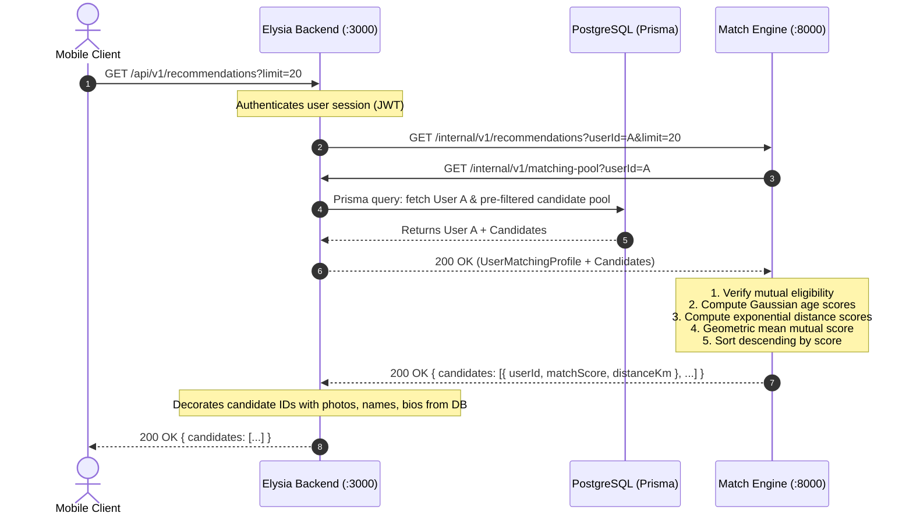
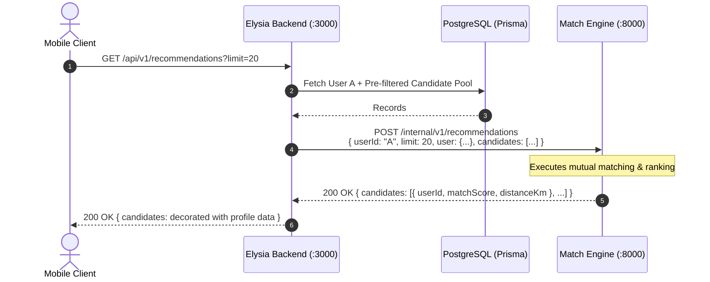
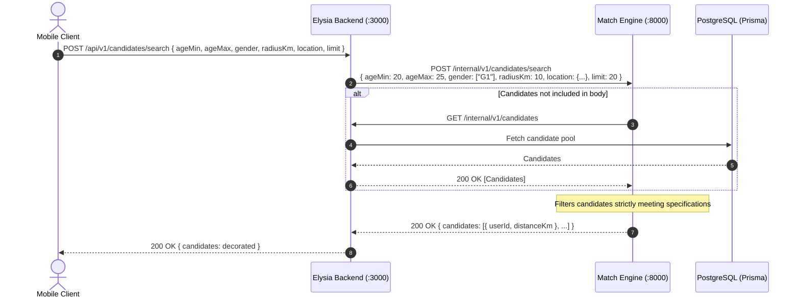

# Match Engine: Backend Requirements & Prisma DAL Specification

**Project:** Online Dating System (SEN-201)    
**Target Service:** Elysia Backend (`api:3000`)  
**Consumer Service:** Match Engine (`match-engine:8000`)  

---

## 1. Executive Summary & Architectural Boundary

The **Match Engine** is a stateless, compute-only microservice built with FastAPI. It performs candidate ranking and mutual eligibility evaluations. It holds no persistent state and **does not connect directly to PostgreSQL**.

The **Elysia Backend** is the sole owner of application persistence, authentication, Prisma Data Access Layer (DAL), and domain business rules.

```text
┌─────────────────┐       ┌─────────────────┐
│  Mobile Client  │       │   PostgreSQL    │
└────────┬────────┘       └────────▲────────┘
         │                         │ Prisma ORM
         ▼                         ▼
┌───────────────────────────────────────────┐
│              Elysia Backend               │
│   (Auth, Profiles, Swipes, Blocks, DAL)   │
└────────┬─────────────────────────▲────────┘
         │                         │
         │ Internal HTTP API       │ Internal Prisma DAL REST API
         │ (/internal/v1/...)      │ (/internal/v1/...)
         ▼                         │
┌──────────────────────────────────┴────────┐
│               Match Engine                │
│    (Stateless Compatibility Scoring)      │
└───────────────────────────────────────────┘
```

---

## 2. Required Elysia Backend Internal Endpoints

The Match Engine communicates with the Elysia backend via HTTP to retrieve user profiles and candidate pools. The backend must expose the following internal routes.

### 2.1 Primary Endpoint: Unified Matching Pool (Recommended)

To minimize network latency and database round-trips, the backend provides an aggregated endpoint returning both the requesting user's profile and the pre-filtered candidate pool.

* **Method:** `GET`
* **Path:** `/internal/v1/matching-pool`
* **Query Parameters:**
  * `userId` (string, required): Unique identifier of the requesting user.

#### Request Example

```http
GET /internal/v1/matching-pool?userId=usr_7f8a9b HTTP/1.1
Host: api:3000
Accept: application/json
```

#### Response Example (`HTTP 200 OK`)

```json
{
  "user": {
    "userId": "usr_7f8a9b",
    "age": 25,
    "dateOfBirth": "2001-05-14",
    "gender": "female",
    "latitude": 13.7563,
    "longitude": 100.5018,
    "targetPreference": {
      "ageMin": 23,
      "ageMax": 30,
      "gender": ["male", "non_binary"],
      "radiusKm": 25.0
    }
  },
  "candidates": [
    {
      "userId": "usr_3c4d5e",
      "age": 27,
      "dateOfBirth": "1999-09-22",
      "gender": "male",
      "latitude": 13.7800,
      "longitude": 100.5200,
      "targetPreference": {
        "ageMin": 22,
        "ageMax": 28,
        "gender": ["female"],
        "radiusKm": 30.0
      }
    },
    {
      "userId": "usr_9a0b1c",
      "age": 26,
      "dateOfBirth": "2000-02-10",
      "gender": "non_binary",
      "latitude": 13.7650,
      "longitude": 100.5120,
      "targetPreference": {
        "ageMin": 24,
        "ageMax": 29,
        "gender": ["female", "male"],
        "radiusKm": 15.0
      }
    }
  ]
}
```

### 2.2 Candidate Pool for Specification Search

Returns active candidate profiles across the platform for specification-based candidate search filtering when candidates are not provided inline in the request payload.

* **Method:** `GET`
* **Path:** `/internal/v1/candidates`

#### Request Example

```http
GET /internal/v1/candidates HTTP/1.1
Host: api:3000
Accept: application/json
```

#### Response Example (`HTTP 200 OK`)

```json
{
  "candidates": [
    {
      "userId": "usr_3c4d5e",
      "age": 27,
      "gender": "male",
      "latitude": 13.7800,
      "longitude": 100.5200
    },
    {
      "userId": "usr_9a0b1c",
      "age": 26,
      "gender": "non_binary",
      "latitude": 13.7650,
      "longitude": 100.5120
    }
  ]
}
```

*(Note: An array `[...]` response is also supported.)*

---

## 3. Backend Pre-filtering Requirements (Prisma DAL Responsibility)

Before delivering candidate profiles to the Match Engine, the Elysia Backend Prisma DAL **must apply the following SQL / Prisma filters**:

1. **Self Exclusion**
2. **Location & Preference Completeness**: Only return profiles having valid coordinates and populated preferences:

---

## 4. End-to-End Interaction Flows

### 4.1 Recommendations Pull Flow (Standard)



### 4.2 Recommendations Push Flow (Direct Payload)

The Elysia backend can also pre-fetch user and candidates, avoiding the secondary HTTP callback:



### 4.3 Specification Candidate Search Flow



---

## 5. Error Handling & Edge Cases

| Scenario | HTTP Status | Response Error Envelope | Action Expected by Backend |
|---|:---:|---|---|
| Requesting user not found in database | `404 Not Found` | `{"error": {"code": "USER_NOT_FOUND", "message": "User not found"}}` | Elysia returns `404` to client. |
| Incomplete candidate profile (missing location / DOB) | `400 Bad Request` | `{"error": {"code": "INVALID_INPUT", "message": "Validation error: ..."}}` | Check Prisma query select fields. |
| Candidate pool is empty | `200 OK` | `{"candidates": []}` | Return empty recommendations array to client. |
| Match Engine unreachable / timeout | `502 Bad Gateway` | `{"error": {"code": "BACKEND_ERROR", "message": "Failed to connect..."}}` | Log error and return `503` to client. |
